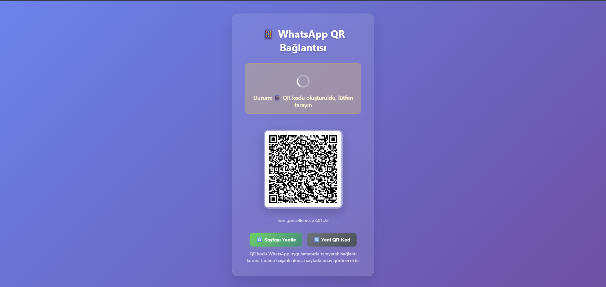
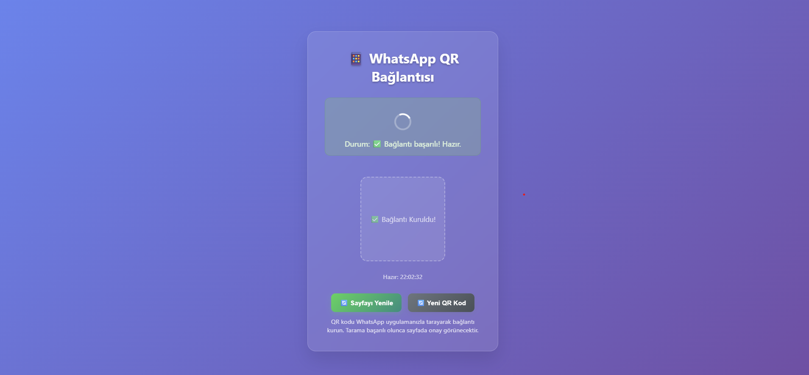
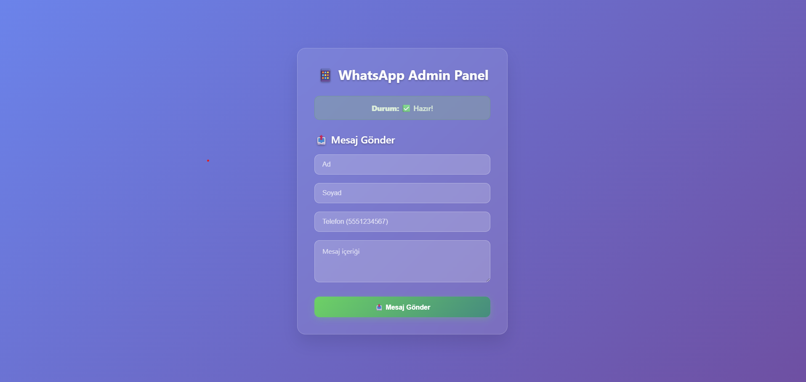

# WhatsApp Otomatik Mesaj Sistemi

<div align="center">


**Doğum günü kutlamalarını ve toplu mesajları otomatikleştiren akıllı WhatsApp çözümü**

[Özellikler](#-özellikler) • [Kurulum](#-kurulum) • [Kullanım](#-kullanım) • [Ekran Görüntüleri](#-ekran-görüntüleri)

</div>

## 🚀 Özellikler

- **🤖 Otomatik Mesajlaşma**: Doğum günü mesajlarını otomatik gönderin
- **📊 Toplu Mesaj**: Aynı anda birden çok kişiye mesaj gönderin
- **🎨 Modern Arayüz**: Kullanıcı dostu web arayüzü
- **🔒 Güvenli Bağlantı**: Yerel kimlik doğrulama ile güvenli oturum yönetimi
- **📱 QR Kod Desteği**: WhatsApp Web bağlantısı için kolay QR kod erişimi
- **⚡ Gerçek Zamanlı Durum**: Bağlantı durumunu anlık takip edin

## 📦 Kurulum

### Gereksinimler
- Node.js 16.0 veya üzeri
- npm veya yarn
- WhatsApp hesabı

### Adım Adım Kurulum

1. **Depoyu klonlayın**:
```bash
git clone https://github.com/sizin-kullanici-adiniz/whatsapp-auto-message.git
cd whatsapp-auto-message
Bağımlılıkları yükleyin:
```

```bash
npm install
Ortam değişkenlerini ayarlayın (isteğe bağlı):
```
```bash
cp .env.example .env
# .env dosyasını düzenleyin
Uygulamayı başlatın:
```
```bash
npm start
Tarayıcınızda açın:

text
http://localhost:3000
```

<div class="usage-container"> <div class="usage-section"> <h2>🎯 Kullanım</h2>
text
<div class="usage-card">
  <h3>QR Kod ile Bağlanma</h3>
  <div class="steps">
    <div class="step">
      <div class="step-number">1</div>
      <div class="step-content">
        Ana sayfada yer alan "QR Kod Göster" butonuna tıklayın
      </div>
    </div>
    <div class="step">
      <div class="step-number">2</div>
      <div class="step-content">
        WhatsApp uygulamanızı açın ve "Bağlı Cihazlar" bölümüne girin
      </div>
    </div>
    <div class="step">
      <div class="step-number">3</div>
      <div class="step-content">
        QR kodu tarayarak bağlantıyı kurun
      </div>
    </div>
    <div class="step">
      <div class="step-number">4</div>
      <div class="step-content">
        Bağlantı başarılı olduğunda yeşil onay işareti göreceksiniz
      </div>
    </div>
  </div>
</div>

<div class="usage-card">
  <h3>Mesaj Gönderme</h3>
  
  <div class="message-type">
    <h4>Tekli Mesaj:</h4>
    <ul>
      <li>Yönetim panelinde kişi seçin</li>
      <li>Özelleştirilmiş mesaj yazın</li>
      <li>"Gönder" butonuna tıklayın</li>
    </ul>
  </div>
  
  <div class="message-type">
    <h4>Toplu Mesaj:</h4>
    <ul>
      <li>CSV veya Excel dosyası yükleyin</li>
      <li>Mesaj şablonu oluşturun</li>
      <li>Zamanlama ayarlarını yapılandırın</li>
      <li>"Toplu Gönder" i başlatın</li>
    </ul>
  </div>
</div>

<div class="usage-card">
  <h3>Whatsapp bağlantısı yapma ve mesaj atma sayfaları</h3>
  <div class="features-grid">
    <div class="feature">
      <div class="feature-icon">📊</div>
      <div class="feature-content">
        <strong>Qr ile bağlantı gerçekleştirme</strong> 
        <strong>MEsaj gönderebilme</strong> 
      </div>
    </div>
  </div>
</div>
</div> <div class="screenshots-section"> <h2>📸 Ekran Görüntüleri</h2>
text
<div class="screenshot-card">
  <h3>Ana Sayfa ve QR Kod Ekranı</h3>
  <div class="screenshot-placeholder">
    
  </div>
  <p class="screenshot-desc">Modern ve kullanıcı dostu ana arayüz</p>
</div>


<div class="screenshot-card">
  <h3>Başarılı Bağlantı</h3>
  <div class="screenshot-placeholder">
    
  </div>
  <p class="screenshot-desc">WhatsApp bağlantısının başarıyla kurulduğunu gösteren ekran</p>
</div>
<div class="screenshot-card">
  <h3>Mesaj atma sayfası</h3>
  <div class="screenshot-placeholder">
    
  </div>
  <p class="screenshot-desc">Mesaj atma ekranı</p>
</div>

🏗️ Proje Yapısı
```
whatsapp-auto-message/
├── src/
│   ├── controllers/     # İş mantığı kontrolcüleri
│   ├── models/         # Veri modelleri
│   ├── routes/         # Express route'ları
│   ├── services/       # WhatsApp servisleri
│   ├── public/         # Static dosyalar
│   └── views/          # EJS şablonları
├── config/             # Yapılandırma dosyaları
├── uploads/            # Yüklenen dosyalar
└── tests/              # Test dosyaları
```

🔧 Yapılandırma
Çevre Değişkenleri
```
env
PORT=3000
SESSION_SECRET=your_secret_key
WHATSAPP_SESSION_DIR=sessions
LOG_LEVEL=info
```

WhatsApp Ayarları
```
javascript
{
  authStrategy: LocalAuth,
  puppeteer: { 
    headless: true,
    args: ['--no-sandbox', '--disable-setuid-sandbox']
  }
}
```

```bash
NODE_ENV=production
PORT=3000
Process manager kurulumu (PM2 önerilir):
```
```bash
npm install -g pm2
pm2 start ecosystem.config.js
Reverse proxy ayarları (Nginx):
```
```nginx
server {
    listen 80;
    server_name yourdomain.com;
    
    location / {
        proxy_pass http://localhost:3000;
        proxy_http_version 1.1;
        proxy_set_header Upgrade $http_upgrade;
        proxy_set_header Connection 'upgrade';
        proxy_set_header Host $host;
        proxy_cache_bypass $http_upgrade;
    }
}
```
🤝 Katkıda Bulunma
Katkılarınızı bekliyorum! Lütfen şu adımları izleyin:
```
Fork edin

Feature branch oluşturun (git checkout -b feature/AmazingFeature)

Commit edin (git commit -m 'Add some AmazingFeature')

Push edin (git push origin feature/AmazingFeature)

Pull Request açın
```
📄 Lisans
Bu proje MIT lisansı altında lisanslanmıştır. Detaylar için LICENSE dosyasına bakın.

⚠️ Sorumluluk Reddi: 
Bu proje, WhatsApp'ın resmi bir ürünü değildir ve WhatsApp'ın hizmet şartlarına uygun olarak kullanılmalıdır. Kullanıcılar kendi sorumluluklarında kullanmalıdır.

<div align="center">
⭐ Bu projeyi beğendiyseniz yıldız vermeyi unutmayın!

</div> 
